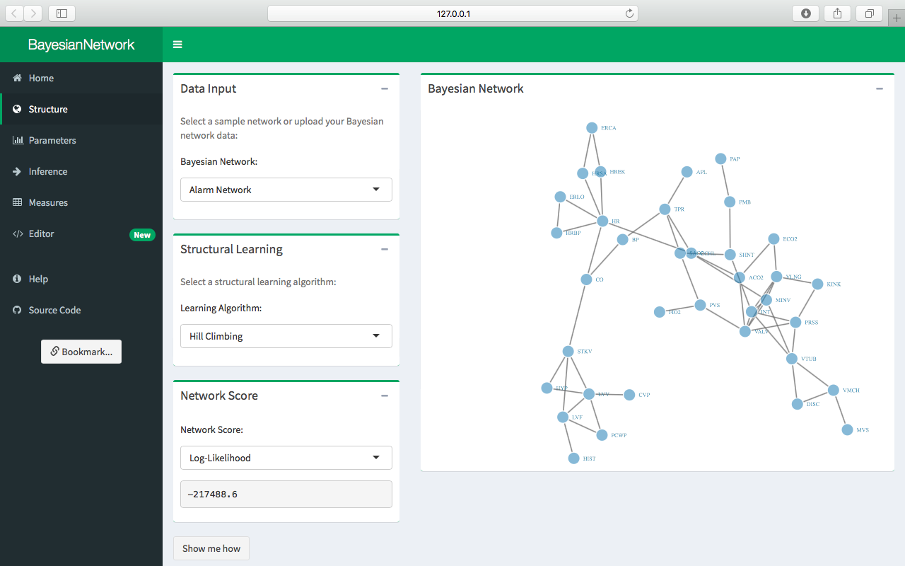

# Summary

`BayesianNetwork` [@BayesianNetwork] is a `shiny` [@shiny] web application for Bayesian Network modeling and analysis, providing a front-end to the `bnlearn` [@scutari2009learning] package for Bayesian Network learning. The application includes structural learning algorithms for learning the structure of the network with support for both discrete and continuous variables, parameter learning methods for estimating the network parameters, procedures for adding evidence to the network and performing Bayesian inference, and node and network utilities for measuring the importance of connections in the network. `BayesianNetwork` originated as a research project for risk analysis applications, where the primary motivation was to develop an app for modeling and analyzing Bayesian Networks in an interactive environment [@govan2016resource]. The goal is that the package be both powerful and intuitive, serving as a tool for researchers, educators and students alike. The package documentation includes examples and additional resources for running the software.

# References
